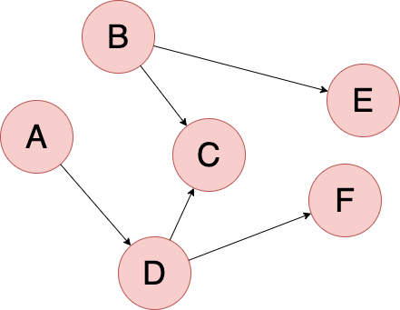

__[home](../) / Types of Graphs / Directed graph__

A __directed graph__ or __digraph__ is a graph in which edges have orientation. For example, the edge (u,v) is the edge from node u to v.

[back](../)