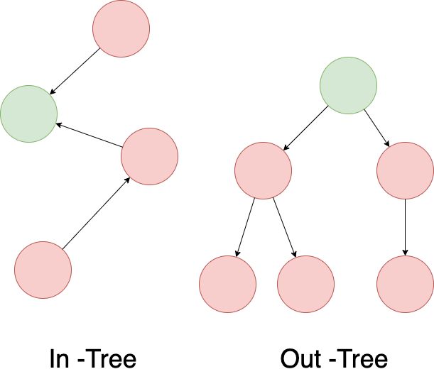

__[home](../) / Special Type of Graphs / Trees__

A _rooted tree_ is a tree with a designated root node where every edge either points away from or towards the root node. when edges point away from the root the graph is called an _arborescenc_(out-tree) and _anti-arborescenc_ (in-tree) otherwise.

[back](../)