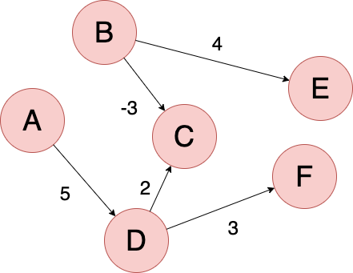

__[home](../) / Types of Graphs / Weighted graph__

Many graphs can have edges that contain a certain weight to represent an arbitary value such as cost, disance, quantity, etc...

Usually denoted an edge of such graph as a triplet (u,v,w) and specify whether the graph is directed or undirected.

[back](../)